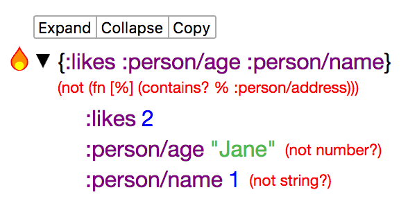

# data-frisk-rum

> "Get your facts first, then you can distort them as you please" - Mark Twain

Visualize your data in your Rum apps as a tree structure.

Suitable for use during development.


## Install


Add `data-frisk-rum` to the dev `:dependencies` in your `project.clj`

## Usage

This library's public API consists of two rum components: `datafrisk.core/DataFriskShell` and `datafrisk.core/DataFriskView`.


### DataFriskShell

This is what you see in the animation above. The component renders as a single data navigation "shell" fixed to the bottom of the window. 
It can be expanded/hidden via a toggle at the bottom right hand corner of the screen. 

Example:

```clojure
(ns datafrisk.demo
  (:require [rum.core :as rum]
            [datafrisk.core :as d]))

(defn mount-root []
  (rum/mount
    (d/DataFriskShell
          ;; List of arguments you want to visualize
          {:data {:some-string "a"
                  :vector-with-map [1 2 3 3 {:a "a" :b "b"}]
                  :a-set #{1 2 3}
                  :a-map {:x "x" :y "y" :z [1 2 3 4]}
                  :a-list '(1 2 3)
                  :a-seq (seq [1 2])
                  :an-object (clj->js {:a "a"})
                  :this-is-a-very-long-keyword :g}}
          {:a :b :c :d})
    (js/document.getElementById "app")))
```

### DataFriskView

This component lets you dig in to any data structure. Here's an example of its use:


```clojure
(ns datafrisk.demo
  (:require [rum :as rum]
            [datafrisk.core :as d]))

(def app-state {:animals [{:species "Giraffe" :age 10} 
                          {:species "Rhino" :age 4} 
                          {:species "Monkey" :age 4}]})

(rum/defc AnimalSalute [animal]
  [:div 
    (str "Hi " (:species animal) "!")
    (d/DataFriskView animal)])

(defn mount-root []
  (rum/mount
    [:div
     (for [animal (:animals app-state)]
       (AnimalSalute animal))]
    (js/document.getElementById "app")))
```

### SpecView
This component shows spec error messages in a human friendly way.

```clojure
(s/def :person/name string?)
(s/def :person/age number?)
(s/def :person/address string?)

(s/def :person/person (s/keys :req [:person/name
                                    :person/age
                                    :person/address]))

(s/def :app/persons (s/coll-of :person/person))

;; Render
(SpecView
   {:errors (s/explain-data :person/person {:likes 2
                                            :person/name 1
                                            :person/age "Jane"})})
```



### SpecTitleView

This is a convenience component that adds a title above the SpecView.

```clojure
(SpecTitleView
  {:errors (s/explain-data :person/person {:likes 2
                                           :person/name 1
                                           :person/age "Jane"})})
```


You can also override the title. 

```clojure
(SpecTitleView
  {:title {:style {:font-weight "700" :color "red"}
               :text "What ever you want"}
   :errors (s/explain-data :person/person {:likes 2
                                           :person/name 1
                                           :person/age "Jane"})})

```

#### Parsing exceptions thrown when instrument is enabled

Here is an example of how you can render spec errors that are 
thrown when spec instrumentation finds an error.

```clojure

;; Instrumentation is enabled
(cljs.spec.test.alpha/instrument)

(def state (atom {}))

(try
  (do-stuff)
  (catch js/Error e
    ;; Hack to get the name of the fdef'ed var from message, see why https://dev.clojure.org/jira/browse/CLJ-2166
    (when (:cljs.spec.alpha/problems (ex-data e))
      (swap! state assoc :current-error {:errors (ex-data e)
                                         :title {:text (second (re-find #"Call\sto\s#'(.*)\sdid"
                                                                        (aget e "message")))}}))
      nil))
      
      
;;;; In your render code

(rum/defc My-exception-view-comp [state]
  (SpecTitleView (:current-error state))) 
 
```

### For more

See the dev/demo.cljs namespace for example use. There are also devcards that you can look at.

To see devcards use next figwheel commands:
```bash
lein figwheel

# after figwheel starts:
(start-autobuild cards)
```

## Development
To run tests you should install several node packages:
```bash
npm install
npm install -g karma-cli
```
Then you may run tests with:
```bahs
lein testing
```

